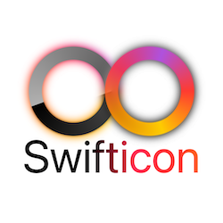

# Swifticon

This package allows you to generate app icons from your SwiftUI code.  
In fact, the icon for this project was generated with the package itself. Want to try out the exact code used? Well here it is:

```swift
let greyscaleGradient = AngularGradient(gradient: Gradient(colors: [.white, .black]), center: .center, startAngle: .zero, endAngle: .degrees(520))
let colorfulGradient = AngularGradient(gradient: Gradient(colors: [.red, .yellow, .orange.opacity(0.8), .pink.opacity(0.8), .purple, .red]), center: .center, startAngle: .zero, endAngle: .degrees(360))

extension View {
    func multicolorGlow(gradient: AngularGradient) -> some View {
        ZStack {
            ForEach(0..<2) { i in
                Rectangle()
                    .fill(gradient)
                    .mask(self.blur(radius: 20))
                    .overlay(self.blur(radius: 5 - CGFloat(i * 5)))
            }
        }
    }

}

struct Icon: PreviewProvider {
    static var previews: some View {
        ZStack(alignment: .center) {
            Group {
                Circle()
                    .strokeBorder(
                            greyscaleGradient,
                            lineWidth: 150
                        )
                    .scaleEffect(0.4)
                    .offset(x: -175, y: 0)
                    .multicolorGlow(gradient: colorfulGradient)
                
                Circle()
                    .strokeBorder(
                            colorfulGradient,
                            lineWidth: 150
                        )
                    .scaleEffect(0.4)
                    .offset(x: 175, y: 0)
                    .multicolorGlow(gradient: greyscaleGradient)
            }
            .offset(x: 0, y: -100)
            
            LinearGradient(colors: [.black, .black, .black, .pink, .red, .orange], startPoint: .leading, endPoint: .trailing).mask({
                Text("Swifticon")
                    .padding(.horizontal, 100)
                    .font(.system(size: 500))
                    .minimumScaleFactor(0.01)
            })
            .offset(x: 0, y: 200)
        }
        .background(Color.white)
        .swifticon()
    }
}
```

## Designing your icons
Simply create a preview that uses the `.swifticon` modifier to get a preview layer that fits for icon designing.

**Example:**
```swift
struct MyIcon: PreviewProvider {
    static var previews: some View {
        VStack {
            /** Icon code here*/
        }
        .swifticon()
    }
}
```

## Generating all app icons
In a unit test, simply call `try! Swifticon.generateIconAssets(...)`
**Example:**
```swift
class generateIcons: XCTestCase {
    func testGenerate() {
        try! Swifticon.generateIconAssets(
        	fromPreviews: MyIcon._allPreviews,
        	forPlatforms: [
                .iPhoneAndiPad(assetsFolderRelativePath: "iOSProjectFolder/Assets"),
                .watchOS(assetsFolderRelativePath: "watch WatchKit App/Assets")
          ]
        )
    }
}
```

### Advanced parameters
`Swifticon.generateIconAssets` supports additional parameters for tweaking output location and more.

**forPlatforms:**  
An array of platforms you want icons generated for. Defaults to all platforms.  
Supported platforms are:
* iOS
* iPadOS
* MacOS
* WatchOS

Each platform needs their relative path included. Example: `myProject/iOSProjectFolder/Assets`.

**iconDirectoryName:**  
Name of the .appiconset folder, without suffix. Defaults to AppIcon.  
Should only be set if you have multiple icons for your application, or renamed the default folder.
     
**drawInHierarchy:**  
Renders complete view hierarchy if true.  
Only set to false if tests is not run towards a simulator or device.  
Might cause unexpected results when false.
     
**path:**  
Needed for getting path to project folder, <font color="red">no value should be set!</font>.  
If you do change this value, make sure its the absolute path to the project your generating icons for.